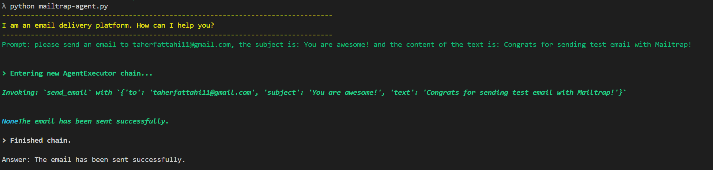

# A Simple MailTrap Agent with LangChain

## Summary
This script serves as a straightforward MailTrap agent designed to interact with the Mailtrap library through prompts.
Example Prompt: 
`Please send an email to taherfattahi11@gmail.com with the subject "You are awesome!" 
and the body of the email should be: "Congratulations on successfully sending a test email with Mailtrap!"`


<a href="https://mailtrap.io">MailTrap (Email Delivery Platform)</a>
<a href="https://github.com/railsware/mailtrap-python">Official Mailtrap Python client</a>

## Getting started
Clone the repository, set up the virtual environment, and install the required packages

```
git clone git@github.com:taherfattahi/mailtrap-agent.git
cd mailtrap-agent
python3 -m venv .venv
. .venv/bin/activate
pip install -r requirements.txt
```

## Store your OpenAI API key
Copy the example env file

`cp .env.example .env`

Now copy your OpenAI API key - mailtrap token - mailtrap sender into the `.env` file, and save the file. It should send up looking something like

`OPENAI_API_KEY=sk-`

`MAILTAP_TOKEN=`

`MAILTAP_SENDER=`

## Start interacting with the agent
Feel free to contribute and implement new tools for this agent.🙂

Press Ctrl + C to exit the chat window at any time.

```python
python3 mailtrap-agent.py
```

